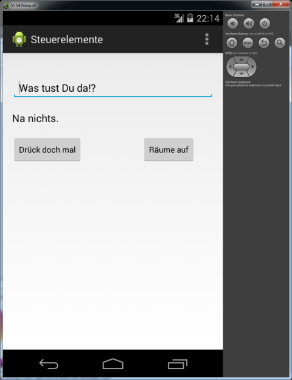
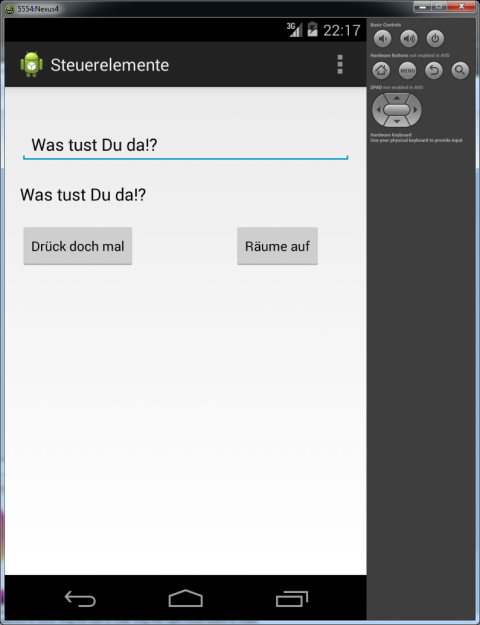
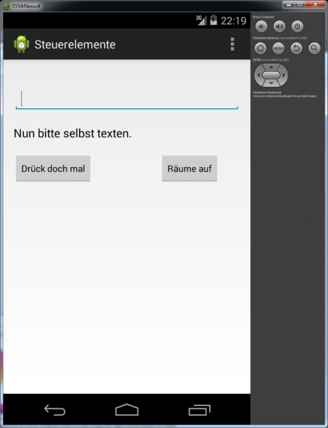

# 3.Steuerelemente-benutzen

[Entwuf]

Die Einleitung wird hier erfolgen...

----

Im klassischen Kontext:

**MainActivity.java**
```java
	@Override
	protected void onCreate(Bundle savedInstanceState) {
		.
		.
		Button b = (Button) findViewById(R.id.btnRaeumeAuf);
		b.setOnClickListener(new OnClickListener() {
			
			@Override
			public void onClick(View v) {

				// Referenz auf Eingabezeile ermitteln  
				EditText et = (EditText) findViewById(R.id.editText1);
				// EingabeZeile leeren
				et.setText("");

				// Referenz auf TextView ermitteln
				TextView tv = (TextView) findViewById(R.id.textView1);
				// 
				tv.setText("Nun bitte selbst texten.");
				
			}
		});
	}
```

----

Im deklaritiven Kontext:

Zunächst ist eine Methode zu implementieren, welche bei 'onClick' aufgerufen werden soll.  
Der Name der Methode ist _nicht_ maßgebend, das links und rechts um den Namen dagegen schon.  

Die Methoden-Deklaration sollte lauten:

__public void__ Namen__(View v)__

Der hervorgehobene Text sollte selbst nach dem Wecker-Klingeln frühmorgens abrufbar sein!  
(Oder wenn der Dozent danach fragt...) 

**MainActivity.java**

	public void onClick_DrueckDochMal(View v) {
		
		// Referenz auf Eingabezeile ermitteln  
		EditText et = (EditText) findViewById(R.id.editText1);
		// Eingabezeile auslesen
		String text = et.getText().toString();

		// Referenz auf TextView ermitteln
		TextView tv = (TextView) findViewById(R.id.textView1);
		// Text der EingabeZeile in die TextView schreiben
		tv.setText(text);
		
	}

Nun zur jeweiligen *activity_xxx.xml*.  
Der oben genannte Methoden-Name ist nun innerhalb der betreffenden _Button_-Deklaration bekannt zu geben.  
Erfolgt dies __nicht__ / wird dies vergessen, wird die onClick-Methode in der Activity auch __nicht__  aufgerufen.

**activity_main.xml**

    <Button
        android:id="@+id/btnDrueckDochMal"
		.
		.
        android:onClick="onClick_DrueckDochMal"
        android:text="Drück doch mal" />

Im Quelltext der 'Activity' wurden diesbezüglich an den betreffenden Stellen nochmals Kommentare angebracht


__Vorschau auf die App__



Okay, nun den Schalter 'Drück doch mal' betätigen.



Es wird der Text aus der Eingabe-Zeile in die TextView übernommen.  
Nun denn Schalter 'Räume auf betätigen'.



Jetzt kann ein eigener Test eingegeben werden.  
Nun wiederum den Schalter 'Drück doch mal' betätigen.  
Es erscheint der selbst eingegebene Text. 
